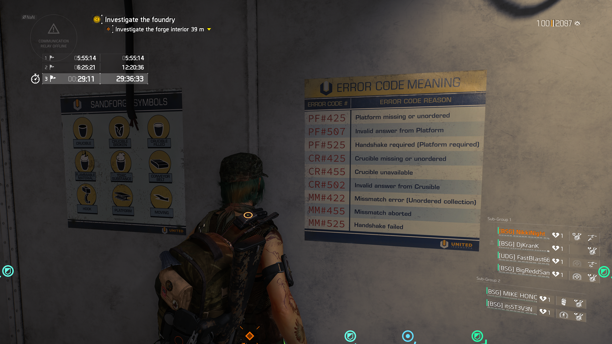

# Iron Horse Error Codes Poster

## Bug Report

- Simple spelling error within the error codes poster found in the control room of the furnace encounter.
  
  Error code CR#502 - Invalid answer from crusible.

- Bug Type: Typo.
- Affected Feature: None, immersion.

## Evidence

## Why is this issue important?
- From a player standpoint, this typo reflects a lack of polish, which can impact immersion and perception of quality.
- From a QA standpoint, it's a minor inconvience that doesn't affect gameplay directly, but worth noting as part of maintaining a professional presentation.
