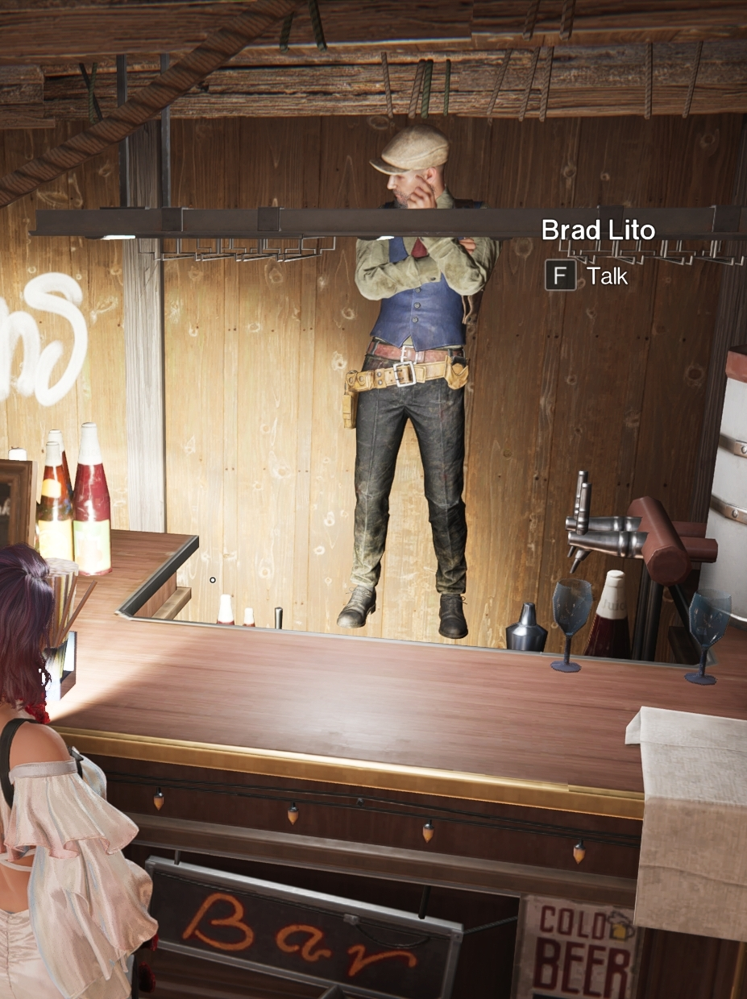

# Multiple Bugs Reported

## Bug Report A - Floating NPC

- The NPC, Brad Lito, in Meyer's Market is floating rather than standing on ground.

 
- Platform: PC/Mobile.  
- Affected Feature: None, immersion.  
- Scenario: Manibus.

## Evidence

## Why is this issue important?
- From a player standpoint, it affects immersion of the game and displays a lack of professional polish.
- From a QA standpoint, showcases a lack of .

---

## Bug Report B - Fishing Bug

- While fishing, fish can be seen appearing and floating above the water.

 
- Platform: PC/Mobile.  
- Affected Feature: Fishing activity, immersion.  
- Scenario: Deviation: Survive, Capture, Preserve.

## Evidence
<a href="https://drive.google.com/drive/folders/1BWpcxLsgTxpddOk2D995gkzu37wIbeXB" alt="Video of fish appearing above the water">Video via Google Drive.</a>

## Why is this issue important?
- From a player standpoint, breaks immersion and reflects poorly on the developers.
- From a QA standpoint, 

---

## Bug Report C

- Zapamander's auto-attack text isn't translated for English/NA servers.

 
- Platform: PC/Mobile.  
- Affected Feature: Deviatations.  

## Evidence

## Why is this issue important?
- From a player standpoint, causes players to need to consult external sources to find what it means.
- From a QA standpoint, it's an inconvience that can affect gameplay directly, leading players to consult external sources to find guidance.

---

## Ackowledgement from the Devs
Compensation was recieved, 100 Mitsuko Marks & 1000 Starchrom, via in-game mail but did not specify for which of the submitted bugs.

