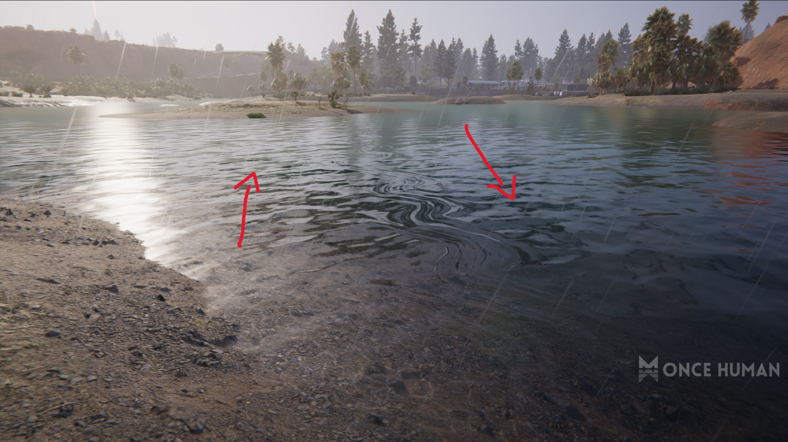

# Water Flow Direction Bug

## Bug Report

- At the location: Blackfell Area (4617,-2696). Water can be seen intersecting and flowing in both directions.

 
- Platform: PC/Mobile.  
- Affected Feature: None, immersion.

## Evidence

## Why is this issue important?
- From a player standpoint, this affects the immersion of the game.
- From a QA standpoint, it's a minor inconvience that doesn't affect gameplay directly, but worth noting as part of maintaining a professional presentation.

## Ackowledgement from the Devs
In-game mail recieved with compensation: 100 Mitsuko Marks & 1000 Starchrom.

