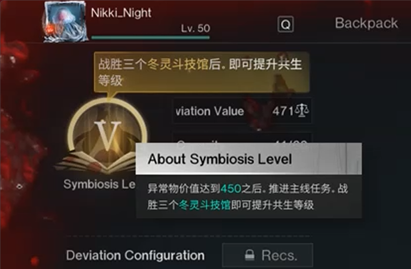
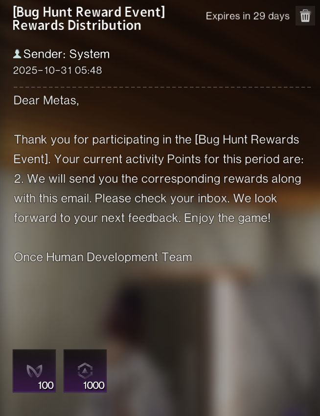

# Wrong Language Used Bug

## Bug Report

- Upon reaching Symbiosis level 5, language displayed with instructions on what to do next are displayed in the wrong language.

 
- Platform: PC/Mobile.  
- Affected Feature: Story/Campaign Progression.  
- Scenario: Deviation: Survive, Capture, Preserve.

## Evidence

## Why is this issue important?
- From a player standpoint, this can be frustrating and confusing.
- From a QA standpoint, it's an inconvience that can affect gameplay directly, leading players to consult external sources to find guidance.

## Ackowledgement from the Devs
In-game mail recieved with compensation: 100 Mitsuko Marks & 1000 Starchrom.

